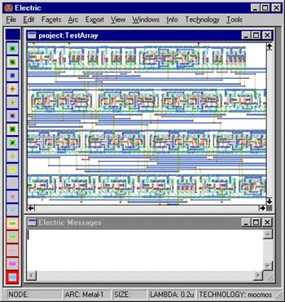
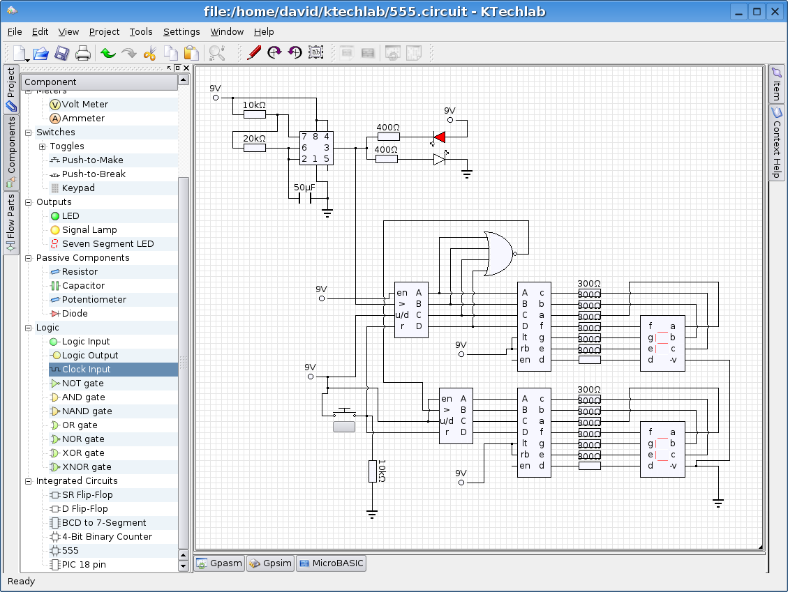
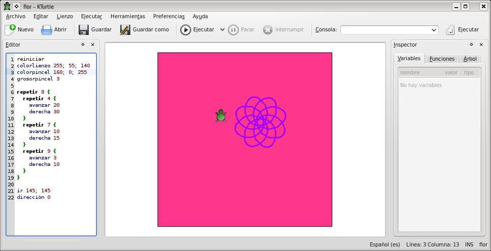
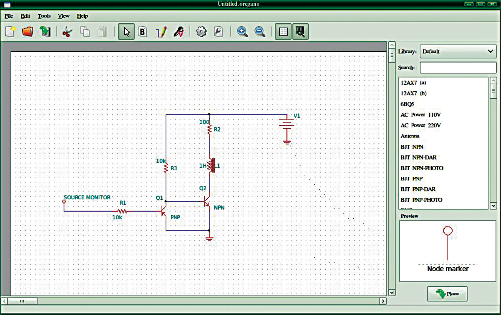
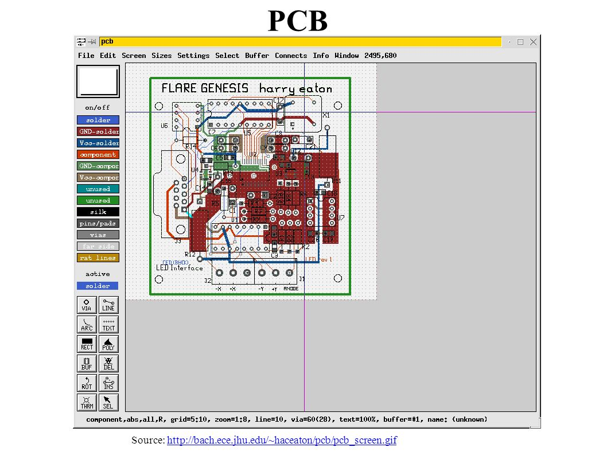
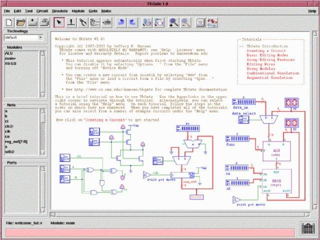
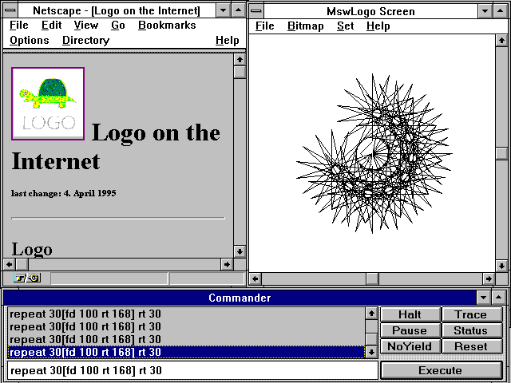
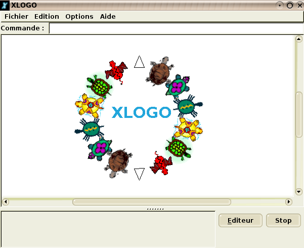

## electric

Programa que permite modelar circuitos eléctricos.  
  
  
  
[Manual de electric](http://www.staticfreesoft.com/documentsUser.html)  
  
## ktechlab

KTechlab es un programa de diseño electrónico, más concretamente para diseñar y simular circuitos con microcontroladores PIC's (actualmente solo soporta 16F84). Entre otras muchas cosas permite:

*Simulación de dispositivos lineales, no lineales y lógicas.  
*Programación mediante: Diagramas de flujos, MicroBASIC,(un lenguaje parecido al Basic) y ensamblador.  
*Diversos dispositivos de salidas: LED's, displays de 8 segmentos.

  
  
[Manual de ktechlab](http://blogdrake.net/files/Ktechlab.pdf)  
  
## KTurtle

KTurtle es un entorno de programación educativa, que utiliza Logo como lenguaje de programación. Una de las características distintivas del LOGO es que las órdenes pueden ser traducidos a diferentes idiomas, permitiendo que todos podamos aprender a programar en nuestro propio idioma.  
  
  
  
[Manual de Kturtle](http://docs.kde.org/stable/es/kdeedu/kturtle/index.html)  

## oregano

Oregano es un capturador de esquematicos y simulador de circuitos de electronicos. Cuenta con una interfaz amigable para el diseño y descripción del circuito a simular. Provee una amplia gama de bibliotecas incluyendo componentes Lineales, CMOS, TTL, Amplificadores operacionales y mucho más. Además permite simular los circuitos diagramados. Realizar análisis de tiempo, de respuesta en frecuencia, de respuesta a valores de continua, y Fourier. Puede elegir entre varias opciones de simulación, utilizar la herramienta de pruebas, editar el listado de componentes (netlist) y realizar pruebas a mano. Oregano soporta GNU Cap y ngSpice como backends de simulación.  
  
  
  
## PCB

Para trabajar con circuitos impresos.  
  
  
  
## TKGate

El TKGate es un editor gráfico y simulador de circuitos digitales, desarrollado con Tcl/TK. Incluyendo componentes básicos como puertas lógicas (AND, OR, XOR, etc ...). Módulos estandars como **sumadores, multiplicadores, registros, memorias, etc ...** y finalmente transistores mos.  
  
  
  
## ucblogo

LOGO es un sencillo lenguaje de programación por comandos. Existen diferentes compiladores de LOGO, uno de los cuales es UCBLogo, un compilador gratuito. Puedes consultar la [página oficial](http://www.cs.berkeley.edu/%7Ebh/logo.html), [descargarte](ftp://ftp.cs.berkeley.edu/pub/ucblogo/ucbwlogosetup.exe) el programa o consultar un [sencillo manual](http://www.box.net/public/xr9drnklmd) con actividades.  
  
  
  
## ViPEC

ViPEC es un analizador de circuitos eléctricos y electrónicos, parte de un fichero de texto en el cual describimos el circuito eléctrico. Le asignamos el rango de frecuencias y características del circuito. Generando como resultado gráficas y tablas correspondientes a la simulación.

  
## Xlogo

Otro programa para progrmar en LOGO.  
  
  
  
  
> Este documento se distribuye bajo una licencia Creative Commons Reconocimiento-NoComercial-CompartirIgual  
  
> Reconocimiento. Debe reconocer los créditos de la obra de la manera especificada por el autor o el licenciador.  
> No comercial. No puede utilizar esta obra para fines comerciales.  
> Compartir bajo la misma licencia. Si altera o transforma esta obra, o genera una obra derivada, sólo puede > distribuir la obra generada bajo una licencia idéntica a ésta.  
  
  
> Para más información visitar: http://creativecommons.org/licenses/by-nc-sa/2.5/es/