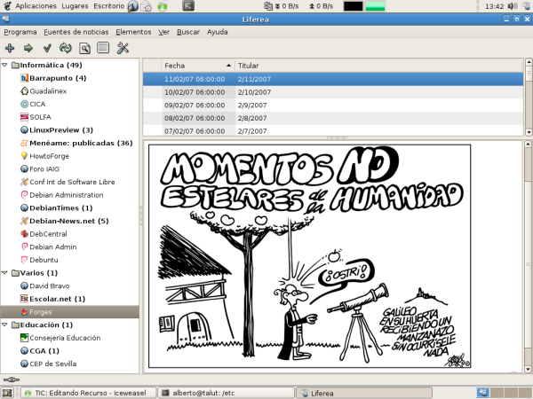

## Sindicación de contenidos web

Según la wikipedia:  

Parte del contenido de una página web se pone a disposición de otros sitios o suscriptores individuales. El estándar de sindicación web más extendido es [RSS](http://es.wikipedia.org/wiki/RSS "RSS"), seguido por [Atom](http://es.wikipedia.org/wiki/Atom "Atom"). Los programas informáticos compatibles con alguno de estos estándares consultan periódicamente una página con titulares que enlazan con los artículos completos en el sitio web original. A diferencia de otros medios de comunicación, los derechos de redifusión de contenidos web suelen ser gratuitos, y no suele mediar un contrato entre las partes sino una licencia de normas de uso.

Esto resulta muy útil cuando hay que estar pendientes de noticias que salen en diferentes sitios o que se actualizan rápidamente. No todas las páginas de noticias incluyen la posibilidad de sindicación web, aquellas que lo hacen normalmente incluyen el siguiente icono:

## Lectores de noticias

Pueden leerse las noticias via RSS a través de marcadores dinámicos del navegador Firefox, pero si se utilizan muchas fuentes es más cómodo utilizar alguna aplicación específica para ello. En Guadalinex, la aplicación instalada para este fin es Liferea:

  

  

> Este documento se distribuye bajo una licencia Creative Commons Reconocimiento-NoComercial-CompartirIgual  
  
> Reconocimiento. Debe reconocer los créditos de la obra de la manera especificada por el autor o el licenciador.  
> No comercial. No puede utilizar esta obra para fines comerciales.  
> Compartir bajo la misma licencia. Si altera o transforma esta obra, o genera una obra derivada, sólo puede distribuir la obra generada bajo una licencia idéntica a ésta.  
  
  
> Para más información visitar: http://creativecommons.org/licenses/by-nc-sa/2.5/es/