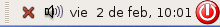
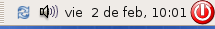
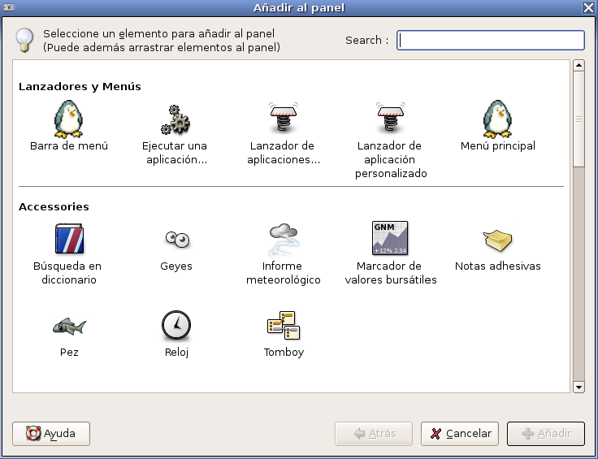

1. Los ordenadores no encienden.

    Compruebe el interruptor general del cuadro de suministro eléctrico, si está desconectado, conéctelo. Si está conectado, y sigue sin haber electricidad significa que no llega electricidad al aula. Esto puede estar debido a que el conector externo del aula esta desconectado. Para comprobar el conector externo debes fijarte en el número del armario de suministro eléctrico y mirar los armarios generales que se encuentran en la siguiente situación:

    * Si estás trabajando en la planta 0, el armario general está en la biblioteca.
    * Si estas trabajando en la planta 1, el armario general está en la sala de visitas 2 (donde está el armario de datos).
    * Si estás trabajando en la planta 2, el armario general está en el pasillo central del instituto. Necesitarás unas escaleras para llegar a él.

    Si todo está conectado y seguimos sin electricidad: tenemos una avería importante o nos han cortado la electricidad.

    Para más información del suministro eléctrico vea el apartado "Estudio de los componentes de un aula TIC".

2. Una fila de ordenadores no funciona.

    

    Comprueba en el armario de suministro eléctrico que todos los diferencias están conectados.

3. Algún ordenador no se enciende

    En las mesas, por debajo, hay varios enchufes y dos diferenciales situados a cada uno de los lados. El enchufe de color rojo se utiliza para el monitor (cable blanco) y son controlados por el pulsador del profesor, los del otro lado se utilizan para el ordenador y los periféricos (cable negro). Junto a los enchufes hay diferenciales que funcionan de forma similar a los del cuadro.

    Si un equipo no enciende debemos verificar que los enchufes están conectados y los interruptores de los diferenciales miran hacia el botón.

    

4. Todos los ordenadores están funcionando, pero cuando desenchufo los monitores algunos se quedan encendidos.

    Hay que comprobar debajo de las mesas y asegurarse de que el cable blanco del monitor esté enchufado en el enchufe rojo. Si no es así será conveniente preguntar al alumno por qué han tocado los cables. En ningún momento un alumno debe manipular los cables de los ordenadores.

5. El encendido automático (CONTROL+F12) no funciona

    Si estamos seguros de que al ordenador llega corriente, debemos encenderlo pulsando la tecla CONTROL y la techa F12 simultáneamente. Este proceso no siempre funciona de primeras, así que debemos ir pulsando estas dos teclas a intervalos pequeños hasta que se encienda el ordenador.

    De todas formas estamos notando que este sistema de encendido no funciona bien en determinadas ocasiones (este problema se está tratando de arreglar), sería bueno que el profesor pudiera tener la llave pequeña, que abre los armarios aulas de los ordenadores para que se puede encender manualmente el ordenador.

6. Encendemos el ordenador y aparece en pantalla el siguiente mensaje: Press F1 to Run SETUP. Press F2 to load default values and continue.

    Pulsamos F2 y debe continuar la carga normal del sistema. De todas maneras es conveniente que nos fijemos la próxima vez que arrancamos el equipo, porque si sigue saliendo el mensaje puede significar que tengamos una avería.

7. Llegamos a la pantalla de autentificación de Gudalinex v3 y no autentifica nuestro nombre de usuario y contraseña

    

    Cada usuario del sistema tiene asignado un nombre de usuario y una contraseña para acceder a su espacio. En ocasiones cuando vamos a introducir nuestro nombre de usuario y contraseña el ordenador no es capaz de autentificarlo. Eso es debido a que el servidor de contenidos del armario de datos no está funcionando bien. La única solución es contactar con el coordinador TIC para que desde el CGAse arregle el problema.

8. Hemos entrado en el sistema pero internet no funciona en ningún ordenador

    

    Compruebe que el punto de acceso esté encendido. Compruebe que el LED "LAN" este en verde. Puede también apagar el punto de acceso (desconectándolo de la red eléctrica), esperar unos segundos y volver a encenderlo.

    Si sigue el problema es posible que haya un corte en internet, póngase en contacto con el coordinador TIC para llamar al CGA y lo arreglen.

9. Algún ordenador no accede a internet

    Puede ocurrir que algún ordenador no esté conectado a internet, para conectarlo debe comprobar el icono de la parte superior derecha, si encontramos un cruz roja significa que no está conectado, debemos pulsar el botón derecho y conectar en "ra0: Red wireless".

    Los iconos que nos podemos encontrar son los siguientes:

     

    En este caso la red inalámbrica esta funcionando de manera adecuada.

    

    En esta caso no hay conexión y no tenemos internet. Para solucionarlo debemos pulsa sobre la cruz roja y elegir la opción Wireless, durante unos segundos aparecerá el siguiente icono:

    

    Que significa que está cogiendo una nueva dirección IP, y posteriormente aparecerá el primer icono.

10. El escritorio ha perdido los paneles superiores o inferiores.

    En ocasiones puede ocurrir que se haya perdido algunos de los paneles de herramientas, en la parte superior o en la inferior. Para obtener de nuevo los paneles hay que seguir las siguientes instrucciones:

    * Al menos siempre tendremos un panel, todos los paneles no se pueden borrar, por lo tanto tendremos siempre uno de los dos paneles.
    * Para añadir un nuevo panel, pulsamos sobre un panel con el botón derecho y elegimos la opción Panel nuevo.
    * Normalmente el nuevo panel creado es muy ancho, por lo tanto elegimos la opción Propiedades, pulsando el botón derecho y le ponemos de anchura 24 píxeles.
    * Ahora tenemos que añadir elementos al panel para dejarlos como estaban anteriormente, para ello elijo la opción Añadir al panel...

    
    
    * Hay que añadir los siguientes elementos, dependiendo de la posición del panel:

        * Si el panel es el inferior:

            * Mostrar el escritorio
            * Lista de ventanas
            * Papelera

        * Si el panel es superior:

            * Barra de menú
            * CGA quota 2
            * Control de volumen
            * Reloj
            * Salir

    * Para terminar dos cosas: primera, deberás elegir la opción Mover para mover los elementos del menú a su sitio correspondiente, y segundo, puedes examinar todos los elementos que puedes añadir a los paneles, pruébalos y colócalos en tu Gudalinex si lo ves de utilidad.

> Referencias:
> Curso TIC IES Atalaya (http://www.juntadeandalucia.es/averroes/iesatalaya/indice.html)

> Este documento se distribuye bajo una licencia Creative Commons Reconocimiento-NoComercial-CompartirIgual

> Reconocimiento. Debe reconocer los créditos de la obra de la manera especificada por el autor o el licenciador.
> No comercial. No puede utilizar esta obra para fines comerciales.
> Compartir bajo la misma licencia. Si altera o transforma esta obra, o genera una obra derivada, sólo puede distribuir la obra generada bajo una licencia idéntica a ésta.

> Para más información visitar: http://creativecommons.org/licenses/by-nc-sa/2.5/es/