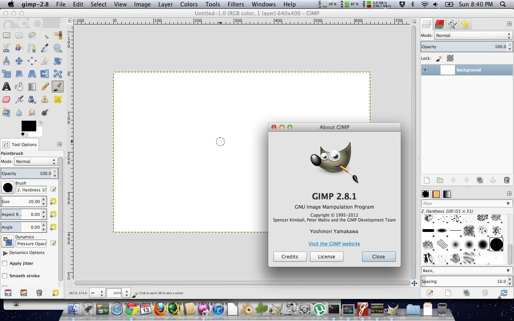
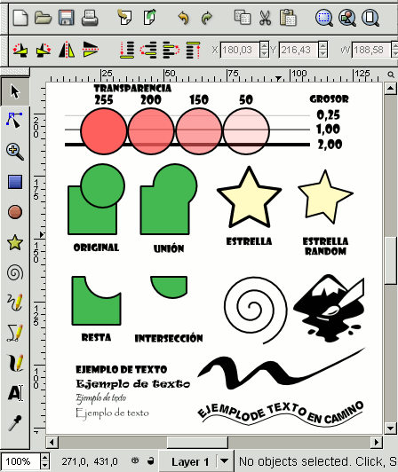
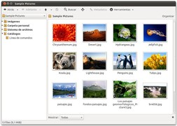

  
  
GIMP es el acrónimo para GNU Image Manipulation Program. Es un programa libre apropiado para tareas como retoque fotográfico, y composición y edición de imagen. Es especialmente útil para la creación de logotipos y otros gráficos para páginas web. Tiene muchas de las herramientas y filtros que se esperaría encontrar en programas comerciales similares, así como algunos interesantes extras.  
  
Recursos  

* [Proyecto Gimp-es](http://www.gimp.org.es/modules/news/)
* [Tutoriales de Gimp](http://www.gimp.org.es/modules/downloadse/)
* [Gimp en Pledin](http://www.josedomingo.org/web/course/view.php?id=22)
* [Manual de Gimp de Mosaic](http://mosaic.uoc.edu/pdf/manual_introduccion_gimp.pdf)  
    
## inkScape  

  
  
Si con GIMP hemos llegado a la conclusión de que es una herramienta libre suficientemente potente para usuarios aficionados y algunos sectores profesionales, con Inkscape podemos llegar a una conclusión parecida en el ámbito de diseño vectorial. Esta potente aplicación, perfectamente integrada al escritorio GNOME, ofrece unas funcionalidades en la linea de programas comerciales como Adobe Illustrator, Freehand, CorelDraw o Xara X. También existe Sodipodi, programa libre a partir del cual algunos desarrolladores iniciaron este proyecto aparte.  
  
Inkscape mantiene un alto compromiso con los estándares del W3C y su desarrollo se centra en obtener el máximo provecho del formato SVG (Scalable Vector Graphics). Con este programa podemos importar imágenes en formatos JPEG, PNG y TIFF, entre otros, y exportar a PNG (otro estándar recomendado por el W3C) además de diversos formatos vectoriales.  
  
La versión estable 0.42, que se está desarrollando en la actualidad, incorpora una interesante funcionalidad de edición colaborativa: varias personas pueden trabajar de forma remota sobre una misma imagen en tiempo real. Habrá que estar atentos a las actualizaciones del repositorio.  
  
Recursos  

* [Tutorial oficial de inkScape nivel básico](http://www.inkscape.org/doc/basic/tutorial-basic.es.html)
* [Manual de inkScape](http://wiki.gleducar.org.ar/wiki/Manual_Inkscape)
* [Documentación oficial](http://www.inkscape.org/doc/index.php?lang=es)

## gThumb
  
  
  
Entre aplicación diminuta y accesorio potente, gThumb es el programa con el que por defecto visualizamos las imágenes guardadas en nuestras carpetas. Con esta herramienta podemos:  

* Visualizar y previsualizar imágenes en los formatos más comunes, incluyendo la posibilidad de rotar la imágenes, invertirlas, pasarlas a blanco y negro...
* Importar fotos de cámaras digitales y acceder a la información EXIF que las imágenes contienen.
* Es una alternativa a la gestión de imágenes mediante el administrador de archivos Nautilus, pudiendo navegar por carpetas, copiar o mover imágenes, etc.
* Permite comentar las imágenes, organizarlas en catálogos y estos a su vez en librerías, al margen de la ubicación y agrupación real de dichas imágenes.
* De hecho es capaz de crear catálogos virtuales dentro de lo ya virtual, acordes con los resultados de búsquedas de imágenes en nuestras carpetas.
* Incorpora funciones básicas de edición: brillo, saturación, contraste, ajuste de colores, orientación, medidas...
* Y más funciones avanzadas como localización de imágenes duplicadas, pases de diapositivas y creación de álbumes en formato HTML listos para ser colgados en una web.

## Otros programas que trabajan con gráficos:

* **Blender:** Para modelar escenas tridimensionales
* **Xsane:** Programa para escanear imágenes
* **QCad:** Diseño asistido CAD para arquitectura e ingeniería

> Este documento se distribuye bajo una licencia Creative Commons Reconocimiento-NoComercial-CompartirIgual  
  
> Reconocimiento. Debe reconocer los créditos de la obra de la manera especificada por el autor o el licenciador.  
> No comercial. No puede utilizar esta obra para fines comerciales.  
> Compartir bajo la misma licencia. Si altera o transforma esta obra, o genera una obra derivada, sólo puede distribuir la obra generada bajo una licencia idéntica a ésta.  
  
  
> Para más información visitar: http://creativecommons.org/licenses/by-nc-sa/2.5/es/