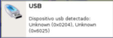
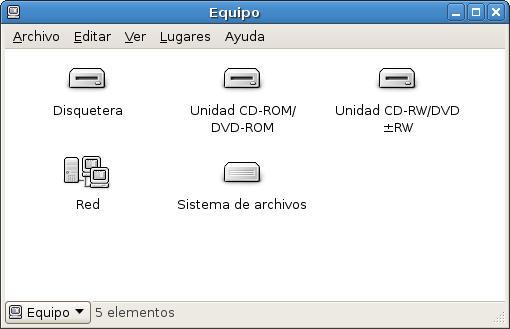
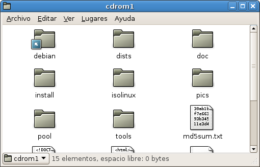

## Introducción

Existen diferentes tipos de dispositivos extraíbles, pero casi todos coinciden en la forma de utilizarse en Guadalinex. Hoy en día las memorias USB son los dispositivos más utilizados por su alta capacidad y rapidez. Los disquetes sólo se utilizan en contadas ocasiones y los CD/DVD para almacenar información de manera permanente: música, películas, copias de seguridad, etc.  

## Montaje del dispositivo  

Una operación que hay que realizar a la hora de utilizar dispositivos extraíbles es la del montaje y desmontaje. En la mayoría de las ocasiones el sistema monta el dispositivo de forma automática al detectarlo, sin embargo habitualmente es el usuario el que debe desmontar el dispositivo para asegurar la integridad de los datos.

Existe una aplicación denominada Hermes que nos informa de los nuevos dispositivos detectados y en el caso de dispositivos extraíbles de su montaje. Aparece una imagen como la siguiente:  

  

  
En caso de que el dispositivo no se monte de forma automática, (por ejemplo no lo hacen los disquetes por ser dispositivos más antiguos), habrá que hacerlo abriendo el dispositivo desde la ventana "Equipo" del escritorio (mediante un "doble click"):  
  

  
  

En ambos casos, montaje automático o manual, aparece un nuevo icono en el escritorio. Algo como:  

  

y se abrirá una nueva ventana mostrando el contenido del dispositivo:  

  

## Copiar y mover  

Copiar será tan sencillo como seleccionar el fichero y arrastrarlo al destino. Si en lugar de copiar queremos moverlo (borrándolo del origen) debemos pulsar la tecla "Mayúsculas" a la vez que arrastramos el fichero.  
  

## Desmontaje del dispositivo

Tras hacer todas las operaciones que se deseen, antes de retirar el dispositivo es muy recomendable realizar la operación de desmontaje, esta consiste en seleccionar el dispositivo en la ventana "Equipo" y pulsar botón derecho. Se abrirá un menú en el que la última opción será "Desmontar el volumen" o "Expulsar" en el caso de unidades de CD/DVD

> Este documento se distribuye bajo una licencia Creative Commons Reconocimiento-NoComercial-CompartirIgual  
  
> Reconocimiento. Debe reconocer los créditos de la obra de la manera especificada por el autor o el licenciador.  
> No comercial. No puede utilizar esta obra para fines comerciales.  
> Compartir bajo la misma licencia. Si altera o transforma esta obra, o genera una obra derivada, sólo puede distribuir la obra generada bajo una licencia idéntica a ésta.  
  
  
> Para más información visitar: http://creativecommons.org/licenses/by-nc-sa/2.5/es/