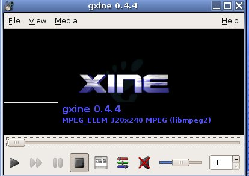
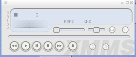
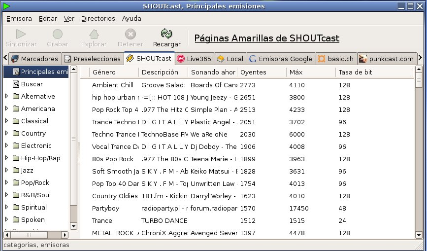

El procedimiento para ver un dvd será tan simple como

* Abrir físicamente la bandeja del lector de DVD
* Colocar el DVD en la bandeja del lector
* Cerrar la bandeja y esperar.

Automáticamente se reproducirá el contenido del DVD con el programa [Totem](http://es.wikipedia.org/wiki/Totem).

**Explicación Animada**

  Pincha en la imagen para ver la animación a su tamaño completo.

## ¿Cómo ver vídeos avi o mpeg?

Los vídeos se pueden ver también con el programa Totem, con el programa GXine, o con el vlc.

## ¿Cómo reproducir un CD de audio?

Reproducir un CD de música ?normal? en Guadalinex V.3 es sumamente sencillo: basta con introducirlo en la bandeja (si el ordenador tiene lector, claro está). El CD se reproducirá entonces automáticamente. El programa que se utiliza para reproducir música se llama XMMS.

## ¿Cómo escuchar la radio en Guadalinex?

Para ello utilizamos el programa StreamTuner.

> Este documento se distribuye bajo una licencia Creative Commons Reconocimiento-NoComercial-CompartirIgual

> Reconocimiento. Debe reconocer los créditos de la obra de la manera especificada por el autor o el licenciador.
> No comercial. No puede utilizar esta obra para fines comerciales.
> Compartir bajo la misma licencia. Si altera o transforma esta obra, o genera una obra derivada, sólo puede distribuir la obra generada bajo una licencia idéntica a ésta.

> Para más información visitar: http://creativecommons.org/licenses/by-nc-sa/2.5/es/