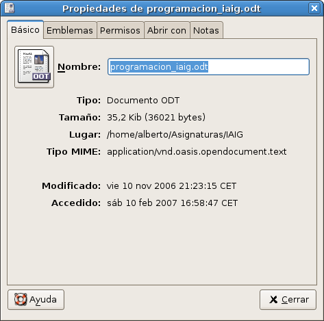
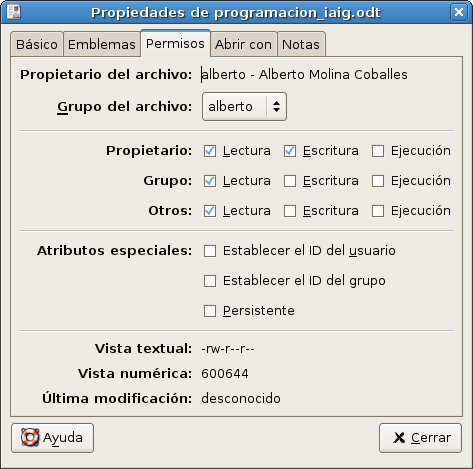
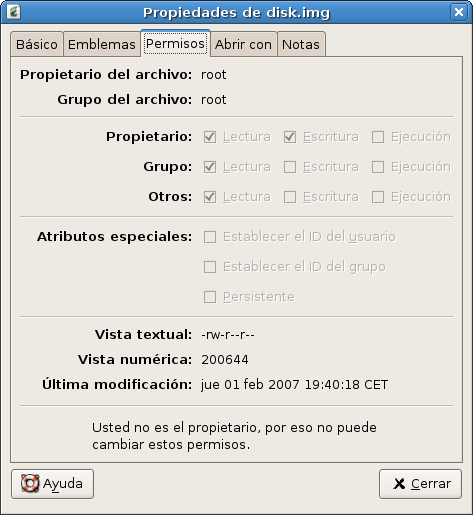

## Permisos de ficheros

El hecho de utilizar un sistema multiusuario implica que cada fichero tiene un propietario y obliga inmediatamente a establecer permisos de lectura y escritura para los demás usuarios. Por ejemplo, sobre el directorio donde almacene mi correo electrónico nadie debe tener permiso de lectura, mientras que en el directorio donde guarde documentos del departamento el resto de profesores pueden tener permiso de lectura (para poder verlos) e incluso algunos permiso de escritura (para poder modificarlos).  

## Permisos de lectura y escritura

Para ver los permisos que tiene un fichero, lo seleccionamos y pulsamos botón derecho. Seleccionamos la opción "Propiedades".  

  
  

Seleccionamos la pestaña "Permisos" y aparece:  
  

  

  
Puesto que este fichero nos pertenece, podemos modificar los permisos según nos parezca. Sin embargo si hacemos lo mismo sobre un fichero que no nos pertenezca, nos saldría algo como:  
  

  
  

Fichero que podemos ver porque tenemos permiso de lectura (en este caso nosotros pertenecemos a "Otros" porque el fichero tiene como propietario al usuario "root"), pero que no podemos modificar.  

## Propietario, grupo y otros

Como puede verse en la imagen anterior, pueden establecerse diferentes permisos al propietario del fichero, al grupo al que pertenece el propietario o incluso a otros (todos los demás).

En el caso de no tener permiso de lectura sobre un fichero o directorio en el navegador de ficheros de Guadalinex aparece un icono como el siguiente, que nos advierte de esta situación:

> Este documento se distribuye bajo una licencia Creative Commons Reconocimiento-NoComercial-CompartirIgual  
  
> Reconocimiento. Debe reconocer los créditos de la obra de la manera especificada por el autor o el licenciador.  
> No comercial. No puede utilizar esta obra para fines comerciales.  
> Compartir bajo la misma licencia. Si altera o transforma esta obra, o genera una obra derivada, sólo puede distribuir la obra generada bajo una licencia idéntica a ésta.  
  
  
> Para más información visitar: http://creativecommons.org/licenses/by-nc-sa/2.5/es/