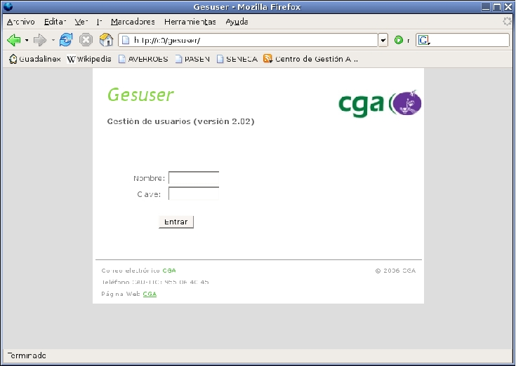
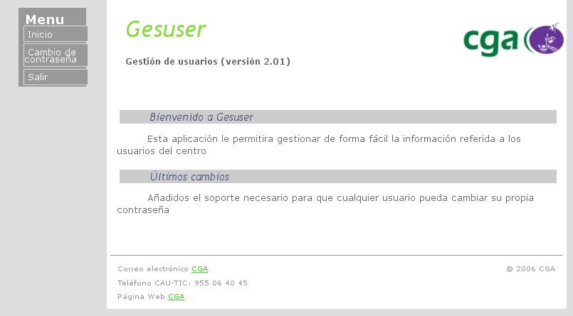
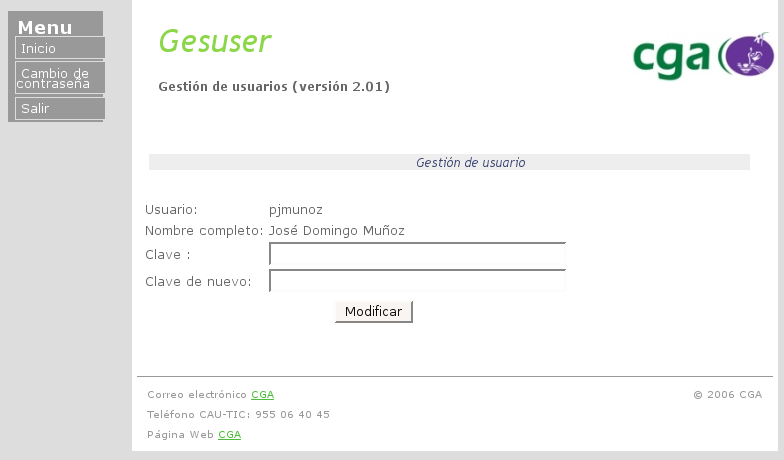

Gesuser es una herramienta que se utiliza para gestionar los usuarios del centro de una manera intuitiva y con la posibilidad de repartir las tareas de coordinación con los compañeros.  
  
## Acceso a la Aplicación.

Gesuser es una aplicación web, por lo que el acceso a ésta se realiza mediante un navegador. En GuadalinexV3 podemos usar Mozilla Firefox, que se encuentra en el menú internet, dentro de aplicaciones. Una vez tengamos el navegador abierto, escribimos lo siguiente en la barra de direcciones:

    c0/gesuser  

y seguidamente pulsamos la tecla intro, lo cual nos llevará a la aplicación. Una vez hecho esto, nos aparece la pantalla de acceso, en ella se nos pide un Nombre de usuario y una Clave para poder acceder a la aplicación.  
  
  
 
Después de poner nuestro nombre de usuario y contraseña, se nos mostrará la isguinete pantalla con un pequeño menú donde podemos elegir la opción de Cambiar la contraseña:  

  

En esa opción podemos cambiar nuestra contraseña:  
  
  
 

> Este documento se distribuye bajo una licencia Creative Commons Reconocimiento-NoComercial-CompartirIgual  
  
> Reconocimiento. Debe reconocer los créditos de la obra de la manera especificada por el autor o el licenciador.  
> No comercial. No puede utilizar esta obra para fines comerciales.  
> Compartir bajo la misma licencia. Si altera o transforma esta obra, o genera una obra derivada, sólo puede distribuir la obra generada bajo una licencia idéntica a ésta.  
  
  
> Para más información visitar: http://creativecommons.org/licenses/by-nc-sa/2.5/es/