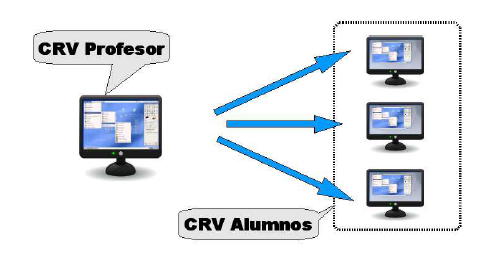
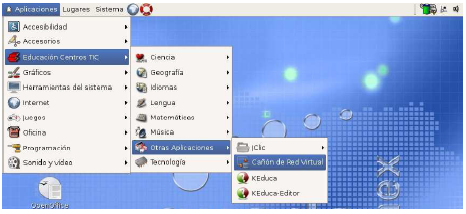
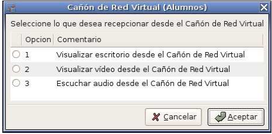
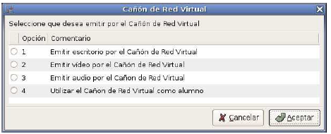

El Cañón de Red Virtual (CRV) es una aplicación creada para transmitir contenido audiovisual a través de una red local, en este caso entre los ordenadores de un aula TIC, facilitando al personal docente su labor haciendo uso de las nuevas tecnologías. Permite la transmisión de contenidos desde cualquier ordenador de un aula hacia los demás siempre y cuando el usuario que quiera transmitir tenga perfil de profesorado.  
  
## Funcionamiento básico del Cañón de Red Virtual  
  
**Importante**: para poder emitir por el CRV tendremos que disponer de perfil de profesor/a, es decir, tendremos que autenticarnos en el sistema con nuestro usuario personalizado de profesor/a.  
  
## Las posibilidades que nos ofrece la aplicación
  
* Emisión del escritorio del profesor/a, permitiendo que los alumnos/as vean las operaciones que realiza su profesor/a con el ordenador.
* Se pueden emitir vídeos desde distintos dispositivos, por ejemplo, lectores de DVD, lectores de CDROM o desde disco duros locales.
* Están soportados los formatos de vídeo mas comunes, como son el DVD, VCD, mpeg o avi.
* Soporte para la emisión de audio y música desde distintos dispositivos, como lectores DVD y CD-ROM o desde el disco duro local.
* Se puede emitir audio con los formatos más usados, como mp3, ogg y discos de audio.

El funcionamiento del CRV es bastante sencillo y consiste, básicamente, en un emisor que transmite los contenidos audiovisuales a los receptores de su aula.  
  

  
  
Para ejecutar la aplicación del CRV tendremos que acceder al menú Aplicaciones, Educación Centros TIC, Otras Aplicaciones , Cañón de Red Virtual, tal y como podemos observar en la siguiente ilustración.  
 
  
  
Cuando hacemos clic sobre la entrada de menú del CRV, la aplicación comprueba que perfil tiene nuestro usuario y dependiendo del resultado nos aparecerán las opciones de emisión (profesorado) o de recepción (el resto de usuarios, incluidos los alumnos/as). Si no disponemos de perfil de profesorado nos debe aparecer una ventana con las opciones de recepción similar a la que podemos ver a continuación.  

  

Por otra parte, si disponemos de perfil de profesorado, las opciones que nos aparecerán son totalmente distintas a las anteriores.  

  
  
**Importante**: es absolutamente necesario que tanto la emisión y la recepción sean del mismo tipo. Por ejemplo, si un/a profesor/a selecciona la opción de emitir escritorio por el CRV, entonces los alumnos/as deben seleccionar la opción de recepción de escritorio. Si los tipos de emisión y recepción no coincide entonces la aplicación no funcionará correctamente.  
  
> Referencias:  
> Guía de Centros TIC (CGA) (http://www.juntadeandalucia.es/averroes/guadalinex/files/guia\_centros\_tic.pdf  
  
> Este documento se distribuye bajo una licencia Creative Commons Reconocimiento-NoComercial-CompartirIgual  
  
> Reconocimiento. Debe reconocer los créditos de la obra de la manera especificada por el autor o el licenciador.  
> No comercial. No puede utilizar esta obra para fines comerciales.  
> Compartir bajo la misma licencia. Si altera o transforma esta obra, o genera una obra derivada, sólo puede distribuir la obra generada bajo una licencia idéntica a ésta.  
  
  
> Para más información visitar: http://creativecommons.org/licenses/by-nc-sa/2.5/es/